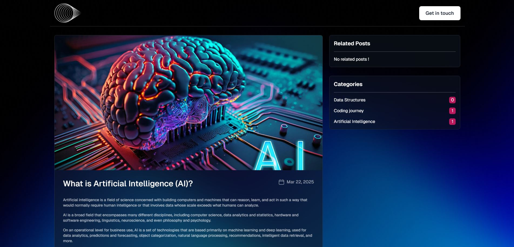

# Blog Project

A modern blog built using **Next.js**, **React**, **Tailwind CSS**, and **Hygraph CMS** (formerly GraphCMS). This project utilizes a headless CMS to manage content with GraphQL, providing an efficient and flexible platform for creating and displaying blog posts.

## Features

- **Headless CMS** with **Hygraph (GraphCMS)**: Fetch and display posts via GraphQL.
- **Dynamic Routes**: Render individual blog posts using Next.js dynamic routes.
- **Responsive Design**: Fully responsive and mobile-friendly layout using **Tailwind CSS**.
- **SEO Optimized**: Custom SEO tags to ensure better search engine ranking for each blog post.
- **Related Posts**: Display related posts based on categories or tags.
- **Post Widgets**: Sidebar widgets for displaying recent posts or similar posts.
- **Markdown Support**: Blog posts support Markdown for rich text formatting.

## Tech Stack

- **Next.js**: A React framework for building static and dynamic websites with features like server-side rendering (SSR) and static site generation (SSG).
- **React**: JavaScript library for building user interfaces.
- **Tailwind CSS**: Utility-first CSS framework for rapidly building custom designs.
- **Hygraph CMS (GraphCMS)**: Headless CMS to manage and deliver content via GraphQL API.
- **GraphQL : a query language for APIs and a runtime for fulfilling those queries with your existing data.

