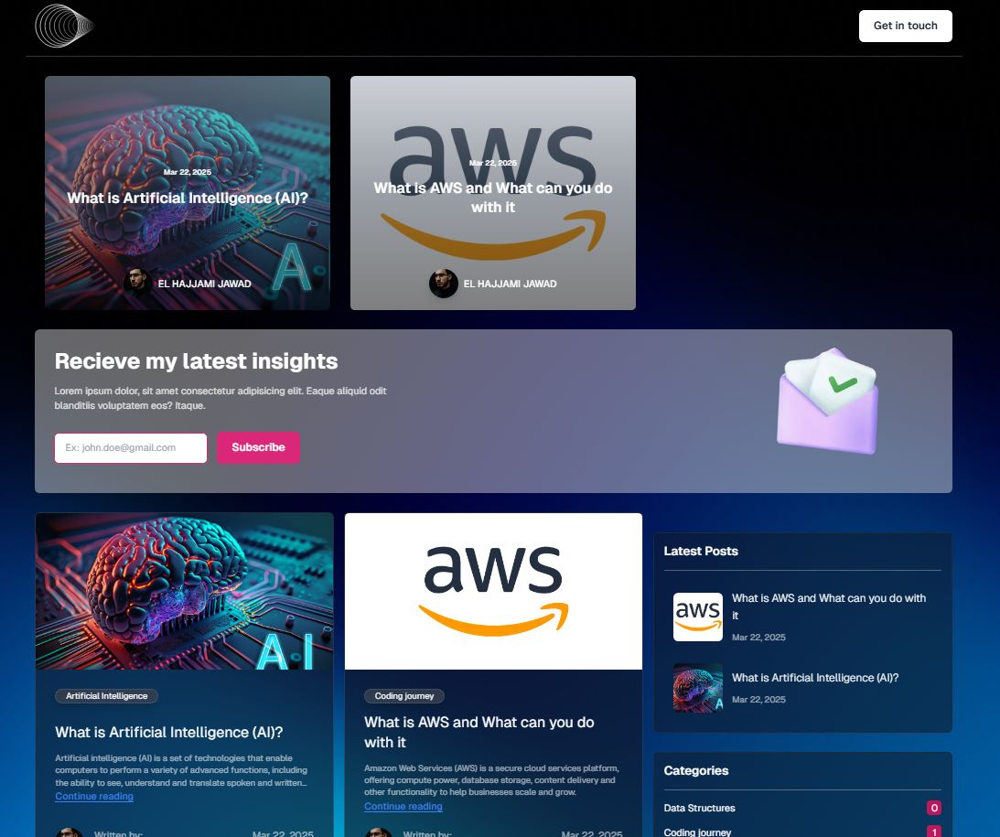

# Blog Project

A modern blog built using **Next.js**, **React**, **Tailwind CSS**, and **Hygraph CMS** (formerly GraphCMS). This project utilizes a headless CMS to manage content with GraphQL, providing an efficient and flexible platform for creating and displaying blog posts.

## Features

- **Headless CMS** with **Hygraph (GraphCMS)**: Fetch and display posts via GraphQL.
- **Dynamic Routes**: Render individual blog posts using Next.js dynamic routes.
- **Responsive Design**: Fully responsive and mobile-friendly layout using **Tailwind CSS**.
- **SEO Optimized**: Custom SEO tags to ensure better search engine ranking for each blog post.
- **Dark Mode**: Toggleable dark mode built with Tailwind's `dark` mode utility.
- **Related Posts**: Display related posts based on categories or tags.
- **Post Widgets**: Sidebar widgets for displaying recent posts or similar posts.
- **Markdown Support**: Blog posts support Markdown for rich text formatting.

## Tech Stack

- **Next.js**: A React framework for building static and dynamic websites with features like server-side rendering (SSR) and static site generation (SSG).
- **React**: JavaScript library for building user interfaces.
- **Tailwind CSS**: Utility-first CSS framework for rapidly building custom designs.
- **Hygraph CMS (GraphCMS)**: Headless CMS to manage and deliver content via GraphQL API.

## Getting Started

First, run the development server:

```bash
npm run dev
# or
yarn dev
# or
pnpm dev
# or
bun dev
```

Open [http://localhost:3000](http://localhost:3000) with your browser to see the result.

You can start editing the page by modifying `pages/index.js`. The page auto-updates as you edit the file.

[API routes](https://nextjs.org/docs/api-routes/introduction) can be accessed on [http://localhost:3000/api/hello](http://localhost:3000/api/hello). This endpoint can be edited in `pages/api/hello.js`.

The `pages/api` directory is mapped to `/api/*`. Files in this directory are treated as [API routes](https://nextjs.org/docs/api-routes/introduction) instead of React pages.

This project uses [`next/font`](https://nextjs.org/docs/basic-features/font-optimization) to automatically optimize and load Inter, a custom Google Font.

## Learn More

To learn more about Next.js, take a look at the following resources:

- [Next.js Documentation](https://nextjs.org/docs) - learn about Next.js features and API.
- [Learn Next.js](https://nextjs.org/learn) - an interactive Next.js tutorial.

You can check out [the Next.js GitHub repository](https://github.com/vercel/next.js/) - your feedback and contributions are welcome!

## Deploy on Vercel

The easiest way to deploy your Next.js app is to use the [Vercel Platform](https://vercel.com/new?utm_medium=default-template&filter=next.js&utm_source=create-next-app&utm_campaign=create-next-app-readme) from the creators of Next.js.

Check out our [Next.js deployment documentation](https://nextjs.org/docs/deployment) for more details.
